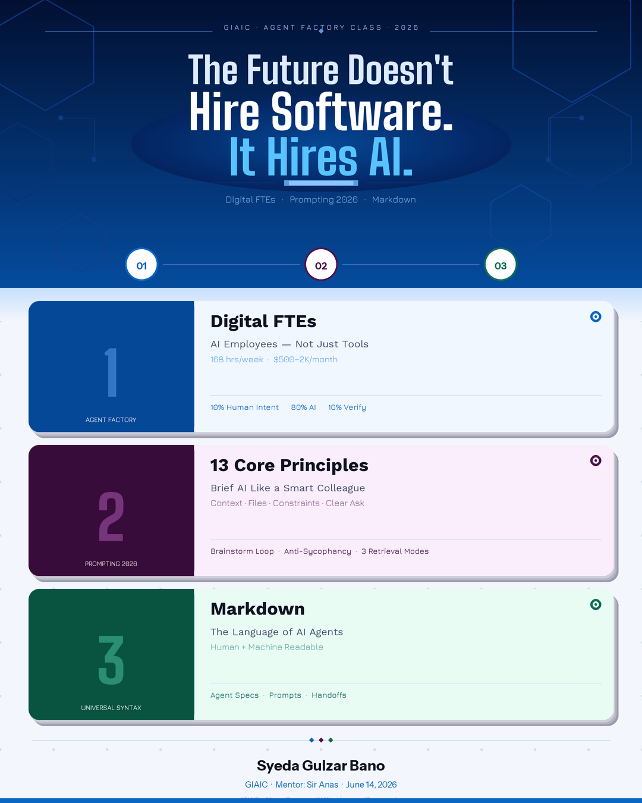

# Canva Design — Claude Code Skills

**Organization:** GIAIC | Mentor: Sir Anas  
**Author:** Syeda Gulzar Bano  
**Date:** June 2026

---

## Overview

This repository contains two Claude Code skills built for LinkedIn content creation, plus the output graphic generated by Skill 1.

---

## Skills

### Skill 1 — Canvas Design (`skills/canvas-design/`)

Generates professional LinkedIn post graphics (1080×1350 px PNG) from any topic using Python + Pillow.

**Key features:**
- Split-panel card design (colored left panel + white right panel)
- Deep navy → LinkedIn blue gradient header with hex watermarks
- 2× supersampled rendering → LANCZOS downsample for crisp output
- Fully dynamic — all content defined in a single `CONTENT` block at the top of `create_graphic.py`
- Three accent colors per card: Blue · Purple · Teal

**Usage:**
```
Invoke: anthropic-skills:canvas-design

Example prompt:
"Create a LinkedIn post graphic about Docker & Kubernetes.
 3 topics: Containerization, Orchestration, CI/CD
 My name: Ahmed Raza | DevOps Pakistan | July 2026"
```

**Output files:**
- `create_graphic.py` — Python script (edit CONTENT block only)
- `linkedin_graphic.png` — final 1080×1350 px PNG

---

### Skill 2 — LinkedIn Post Writer (`skills/linkedin-post-writer/`)

Transforms technical learning notes, class topics, or book chapters into a polished, copy-paste-ready LinkedIn post (200–300 words).

**Key features:**
- Scroll-stopping hooks (stat / bold claim / contrast / question)
- First-person learning-journey voice
- Specific insights — no generic AI platitudes
- Structured: Hook → Body → Closing Question → Mentions → Hashtags
- Built-in quality checklist (word count, forbidden openers, specificity)

**Usage:**
```
Invoke: anthropic-skills:linkedin-post-writer

Example prompt:
"Write a LinkedIn post about today's class:
 Topics: Agent Factory Thesis, AI Prompting 2026, Markdown
 Organization: GIAIC | Mentor: Sir Anas | My name: Syeda Gulzar Bano"
```

---

## Sample Output

The graphic below was generated by Skill 1 for a GIAIC Agent Factory class session:



**Topics covered:**
1. Agent Factory Thesis — Digital FTEs, 10-80-10 Rule
2. AI Prompting 2026 — 13 Core Principles
3. Markdown — Language of AI Agents

---

## Repository Structure

```
Canva-Design/
├── README.md
├── linkedin_graphic.png          # Sample output graphic
├── .gitignore
└── skills/
    ├── canvas-design/
    │   ├── SKILL.md              # Skill instructions for Claude
    │   ├── create_graphic.py     # Python graphic generator
    │   └── agent_factory_philosophy.md
    └── linkedin-post-writer/
        └── SKILL.md              # Skill instructions for Claude
```
